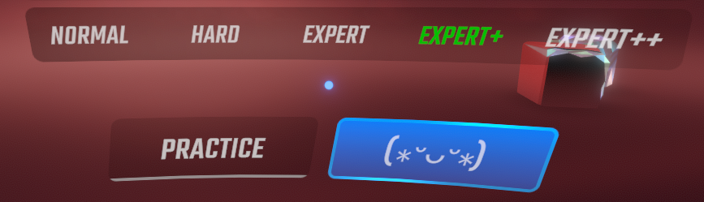

# ConfirmPlaylistDifficulty

プレイリストの難易度を選んでいるかどうかについて、プレイボタンの色やクリックの可否を変更するModです。 

プレイリストの難易度を選んでいる場合  

プレイリストの難易度を選んでいない場合(色変更ではなくクリック不可の設定になっています)  

プレイボタンの色をいじるModと干渉するはずなのでそこはご了承ください。

~注意点がひとつあります。
一度オフにして再びオンにした場合、一度適当なプレイリストを選択しないと色が変わらない仕様になっています。 
バグではなく仕様です。 
誰が何と言おうと仕様です。 
ただ、気が向いたら仕様変更するかもです。~

v1.0.1で上記の仕様もといバグは修正しました。

v1.1.0では以下の更新があります。
[@yatakabs](https://github.com/yatakabs)さんのプルリクでプレイボタンが存在しないときのバグを修正していただきました。 
さらに、堅牢な設計にもしていただきました。 
感謝いたします。 
また、プレイボタンのテキスト変更機能とプレイボタンを押せなくする機能を追加しました。 
プレイボタンのテキストは、Beat Saber/UserData/ConfirmPlaylistDifficulty.jsonを直接編集することで変更できます。 
もし、このファイルが無い場合は、Beat Saberを一度起動・終了させてからもう一度確認してみてください。
